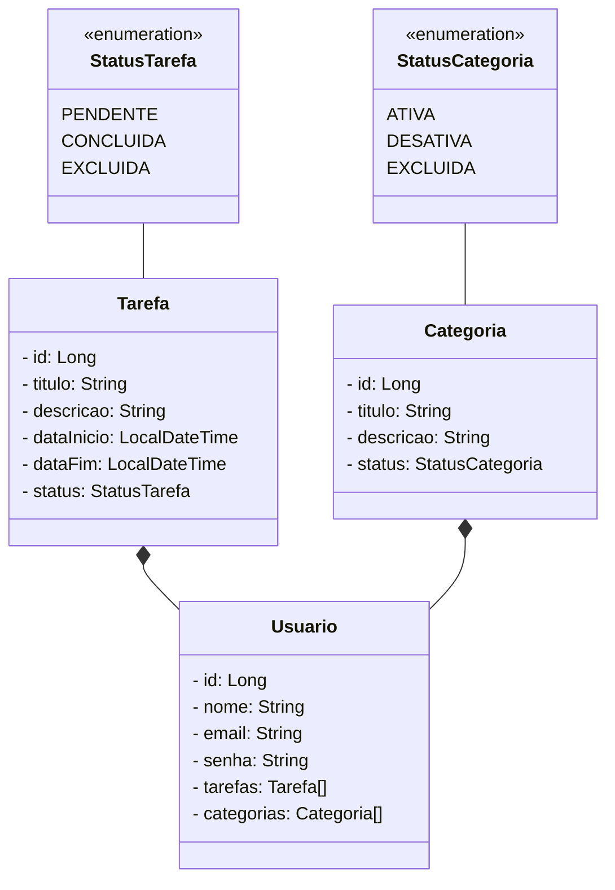

# TODO List API

API REST de lista de tarefas, construido como projeto prático do bootcamp de Spring Boot
e Angular da DIO com o Santander.

## Principais tecnologias

## Diagrama de Classes

```mermaid

classDiagram
    class Usuario {
        - id: Long
        - nome: String
        - email: String
        - senha: String
        - tarefas: Tarefa[]
        - categorias: Categoria[]
    }
    class Tarefa {
        - id: Long
        - titulo: String
        - descricao: String
        - dataInicio: LocalDateTime
        - dataFim: LocalDateTime
        - status: StatusTarefa
     }
     class Categoria {
         - id: Long
         - titulo: String
         - descricao: String
         - status: StatusCategoria
     }
    class StatusTarefa {
        <<enumeration>>
        PENDENTE
        CONCLUIDA
        EXCLUIDA
     }
    class StatusCategoria {
        <<enumeration>>
        ATIVA
        DESATIVA
        EXCLUIDA
     }

    Tarefa*--Usuario
    Categoria*--Usuario
    StatusCategoria -- Categoria
    StatusTarefa -- Tarefa
```