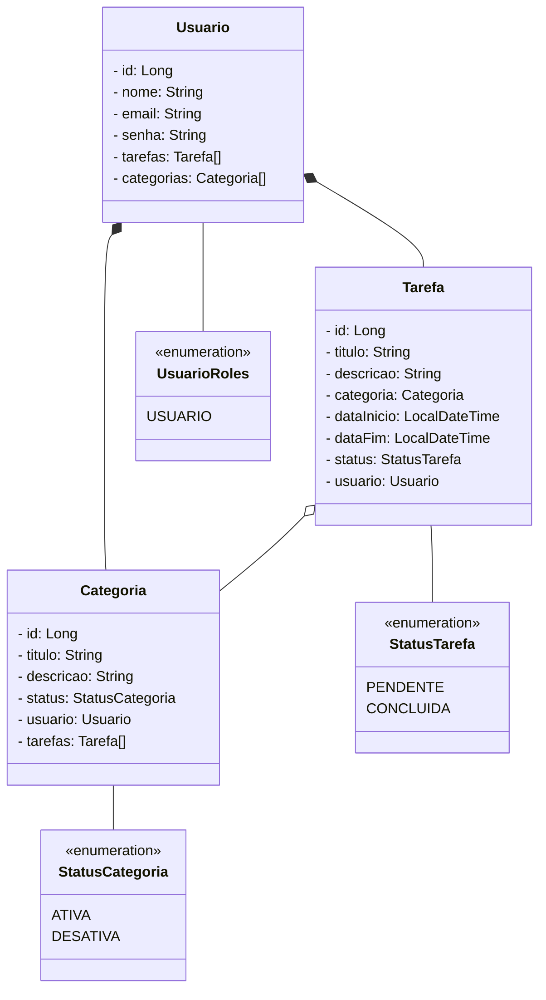

# TODO List API

API REST de lista de tarefas, construido como projeto prático do bootcamp de Spring Boot
e Angular da DIO com o Santander.

## Principais tecnologias

  

## Diagrama de Classes

```mermaid

classDiagram
    class Usuario {
        - id: Long
        - nome: String
        - email: String
        - senha: String
        - tarefas: Tarefa[]
        - categorias: Categoria[]
        
    }
    Usuario *-- Tarefa
    Usuario *-- Categoria
    Usuario -- UsuarioRoles
    
    class Tarefa {
        - id: Long
        - titulo: String
        - descricao: String
        - categoria: Categoria
        - dataInicio: LocalDateTime
        - dataFim: LocalDateTime
        - status: StatusTarefa
        - usuario: Usuario
     }
    Tarefa o-- Categoria
    Tarefa -- StatusTarefa
     
     class Categoria {
         - id: Long
         - titulo: String
         - descricao: String
         - status: StatusCategoria
         - usuario: Usuario
         - tarefas: Tarefa[]
     }
    Categoria -- StatusCategoria
    
     class UsuarioRoles {
         <<enumeration>>
         USUARIO
     }
     class StatusTarefa {
        <<enumeration>>
        PENDENTE
        CONCLUIDA
     }
    class StatusCategoria {
        <<enumeration>>
        ATIVA
        DESATIVA
     }
```
